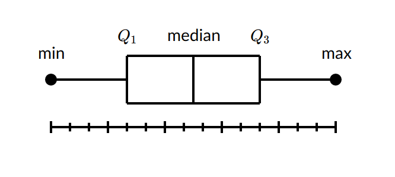
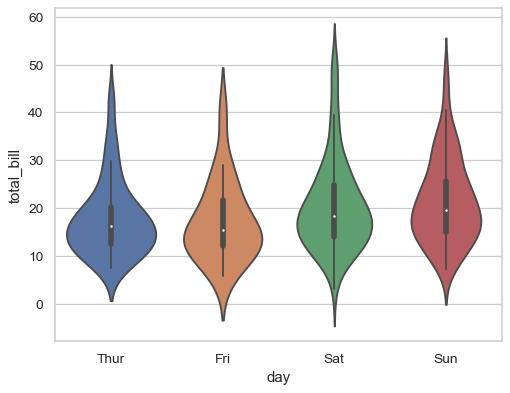

## violinplot

we use seaborn to plot violinplot, [this link](https://seaborn.pydata.org/generated/seaborn.violinplot.html) shows how we use violinplot.

### Basic Knowledge
violinplot gives a straight forwadrd understanding about data distribution.  

#### Box plot
A box and whisker plot, also called a box plot, displays the five-number summary of a set of data. The five-number summary is the **minimum**, **first quartile**, **median**, **third quartile**, and **maximum**. These five elements show how data distributed. We can see the range of the dataset and the median (can be considered most data). 

| |
|---|
||

#### Kernel Density Estimation  
[This page](https://mathisonian.github.io/kde/) gives a intuitive understanding about Kernel Density Estimation. Basically we can see diferent curves based on different kernel and bandwidth. Compare to BoxPlot, KDE has a continous boundry about the distribution of the data, yet we don't know the exact five-elemrnt infos. 

Violinplot conbines info from both boxplot and KDE. We can see a rough data-gathering information (boxplot) as well as the continous distribution (KDE). This allows us has a grasp about dataset.  
  

### Usage
For most usage, the *seaborn page* shall gives us the hint. However, for more usage like changing the text information or, saving multiple plots or, display subplots, we can always use **matploblib** to as a wraping function.
