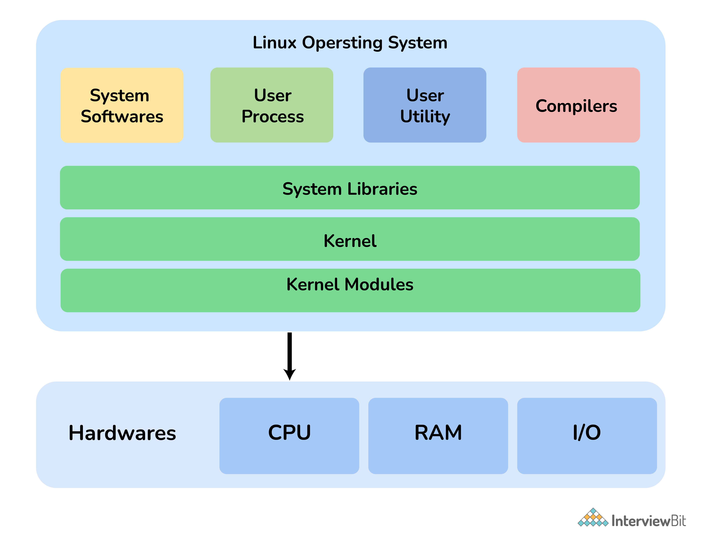
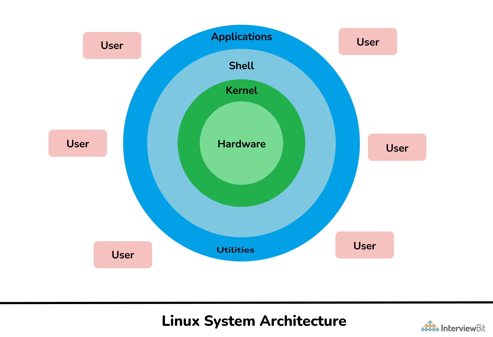

# Linux Usage
<!-- | |
|-| -->

[CLI](#CLI)

[Files and Folders](#Files-and-Folders)

[Common command-line tools](#Common-command-line-tools)

[Networking](#Networking)

[some interview questions](#some-interview-questions)

## CLI
Interpreter in Linux.  
**Bash**: Bourne-again shell  
command-line interface, there are many other shells: **csh**, **ksh**, **bsh**  
1. send typed commmands  
2. display text output  

Command and arguments  
- command : action we use  
- options: how to operate  
- arguments: what things to operate  

In your terminal, it's **username** and **hostname** like this: `endrol@endrol-laptop:~$ `, `endrol` is the username while `endrol-laptop` is the hostname (computer name).     `~` is the current directory, now is **home** folder.  

shortcut
There are some shortcuts that can help you with CLI. 
- Tab: completion
- Text navigation
    - ctrl-A: move to the begining line
    - ctrl-E: move to the end of line
    - ctrl- left, right: move one word at a time
    - ctrl-U: remove command to the begining place
    - ctrl-K: remove the later part of cursor
    - ctrl-R: search history to match

**man** command to help  
``man ls``, gives `ls` command details.

apropos Find command  
``apropos "list"``, show what command can list stuffs. 

## Files and Folders
- file : gives file type, directory or ascii file
- stat : display ownership, modification infos.

In folders, use `\ ` to use space inside a folder name.  
- cd: navigation. 
    - `cd -` : go back to the previous path. Alter the path of two current paths. 

- ls -l / ls -lh : long list with details
- cp a.txt b.txt: copy one file to another file or place.
- mv : move file or rename files.

- find : locate files 

- chmod: change file permissions  
u: user, g: group, o: others  
r: read, w: write, x: execute  
+: add permission, -: remove permission, =: give permissions only what's specified
    - ``chmod u+rwx``: add read, write, execute permission for user. 
    - ``sudo chown root test.sh``: change onership to root  

links, a file that acts as a reference to anotehr file  
Hard links, points data on the disk. Soft link(symbolic link) points a file on the disk. 

- ``ln -s a.txt b.txt`` : soft link
- ``ln a.txt b.txt`` : hard link, (not use for now)

### File system
- / : root, highest level of filesystem hierarchy
- home : stores user's home folders
- root : stores root's home folder
- etc : configuration files for many tools

## Common command-line tools
Unix philosophy: Programs should do one thing and do it well. Many modules tools rather than one big tool. **Modularity and Flexibility**

### Shell programming
Please see this [link](https://www.runoob.com/linux/linux-shell.html) to get more details.

### pipes | 
- ``echo "hello" | wc`` ： wc what echo gives, `wc`: word count

### tools for text
- cat: read filesls
- head, tail : some specified part of text
    - ``cat poems.txt | head -n10`` : read file, then give first 10 lines
- less : read text files like `man`

### **searching for text**
Grep - Global regular expression print
- grep : find desired text in a file. **Regular expression**
    - ``grep -in "the" poems.txt`` : match "the" in poems.txt file. 

### manipulating text
- awk: structred text and output it.
    - ``awk '{print $2 "\t" $1}' simple_data.txt | sort -n``

- sed: changing data
    - ``sed "s/Orange/Red/" simple_data.txt`` : change Orange to Red in text

- sort: sort the data
    - ``sort -k2 -n simple_data.txt`` : sort text file by key2 as numric order

### VIM
- insert mode: i, `shift + i` last place of file
- command mode: esc. `:w` write, `:wq` write and quit. `:q!` exit without save. 
    - `shift + g` : go to last position of file
    - `1 + shift+ g` : go to the first place opf file
    - `(, )` : go previous sentence or next sentence
    - `{, }` : go through paragraph

### Nano

### working with archives
- tar file: compression files
    - `tar caf myfiels.tar.gz Exercise\ Files/` tar files. 
    - `tar xf myfiles.tar.gz -C unpack_directory` : untar files in some place

- zip : zip and unzip
    - `zip -r file.zip hello/` : recursively zip files inside a folder
    - 'unzip file.zip' : unzip this ziped files

### Redirection
- Standard Streams: stdin 0, stdout 1, stderr 2
    - `ls 1>filelist.txt` : save the output of ls into a txt file
    - `echo "append text >>filelist.txt"` : add some appending text into the file

### enviroment and path
- `which ls` : where the command program is
- env: check path
- add path variable:
    - `cd ~ | nano .profile` and add `PATH="$PATH:/path/to/mytools"` : add new tools in PATH

## some Advenced tpoics
- `ls -lah /etc/*release` : system check

- `free -h`

- `df -h`

## Networking

* some default ports  
    Service | Port
    --- | ---
    DNS | 53
    SMTP | 25
    FTP | 20 (Data transfer), 21 (Connection established)
    SSH | 22
    DHCP | 67/UDP (dhcp server), 68/UDP (dhcp client)
    squid | 3128

* ping  
    used to check connection status between source and destination

## some interview questions
[~~Basic knowledge~~](https://www.javatpoint.com/linux-interview-questions) shows some interview question, *not important*  
[Linux interview questions](https://www.interviewbit.com/linux-interview-questions/), this seems has more details.  
1. LILO: Linux Loader. A boot **loader** of Linux. Load OS into the main memory.
2. Some basic components of Linux  

    - kernel: **low level** system software, manage **hardware** resources, process management, device managements.
    - shells: interpreter, between **user and kernel**
    - GUI: Graphical User Interface
    - System Library: access features of the **kernel**
    - application programs

3. daemons
    > Daemons also referred to as the background process, is a **long-running** Linux program that runs in the background.  These are the processes that are generally started when the system is bootstrapped and terminate or end only when the system is shut down.

4. zombie process  
    A process is killed yet its PID (process discriptor) not cleaned from memory.

    Danger of zombie processes: may take all PID (32767 for 32-bit system), preventing other process from launching

5. INODE and Process ID  
    INODE: 
    > a unique name given to each file by OS. Each inode has a unique inode number within a file system.

    Process Id(Identifier):
    > It is a unique Id given to each process. It is simply used to uniquely identify an active process throughout the system until the process terminates.

