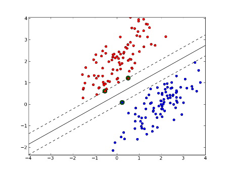
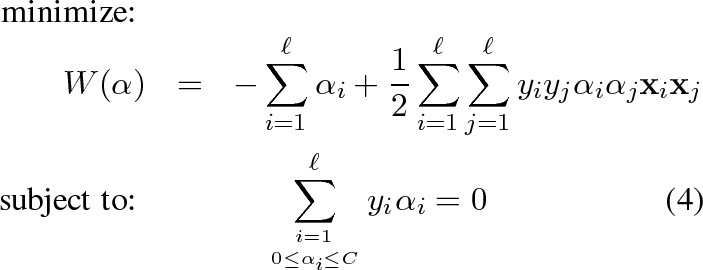

# Support vector machine
## rough understanding

here is [a link](https://towardsdatascience.com/understanding-the-kernel-trick-e0bc6112ef78) that explain in detail, and a brief introduction of SVM is:
>In data classification problems, SVM can be used to it provides the maximum separating margin for a linearly separable dataset. That is, of all possible decision boundaries that could be chosen to separate the dataset for classification, it chooses the decision boundary which is the most distant from the points nearest to the said decision boundary from both classes.  

optimization function is:

SVM的线性函数可以重写为 $w^\mathrm T x+b=b + \sum_{i=1}^{m}{\alpha}_ix^\mathrm T x^{(i)}$, 其中$x^\mathrm T x^{(i)}$可以被替换成$k(x,x^{(i)})=\phi(x)\cdot\phi(x^{(i)})$,$k$为核函数，kernel function

SVM is a classification-based algorithm

* 扩大线性分类函数 $y = w^\mathrm T x + b$ 的边缘
    - maximize $\frac{2}{\|w\|}$ is also $\frac{1}{2}\|w\|^2$
    - a quadratic programming problem
* kernel function
    - this [link](https://medium.com/@zxr.nju/what-is-the-kernel-trick-why-is-it-important-98a98db0961d) may explain what kernel trick is
